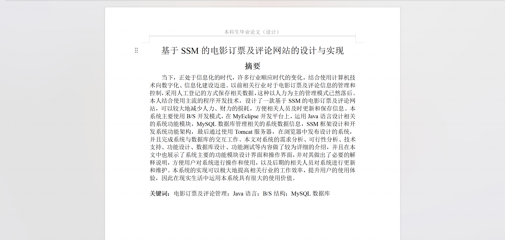
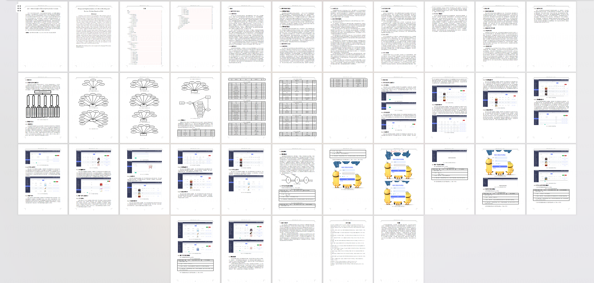
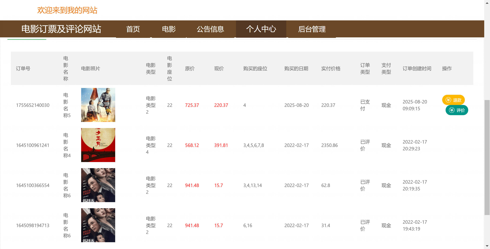
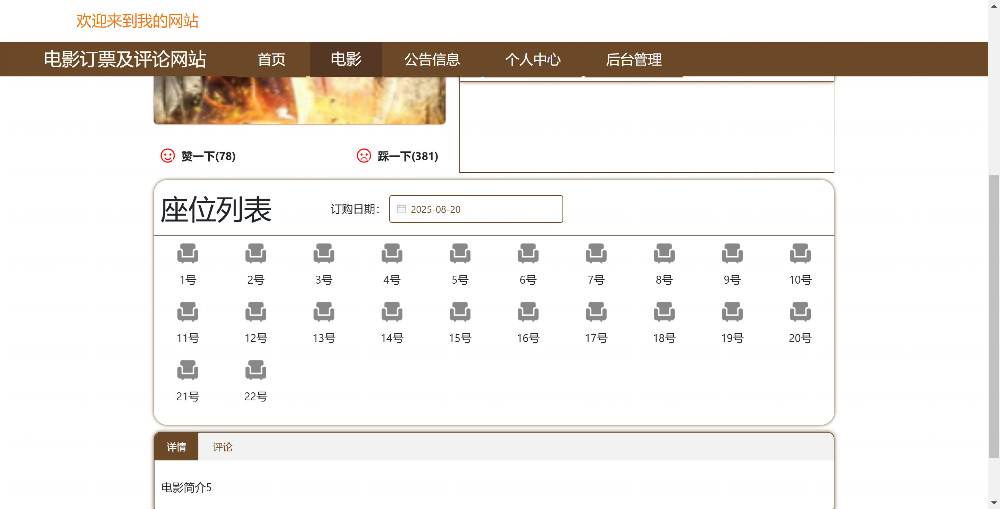
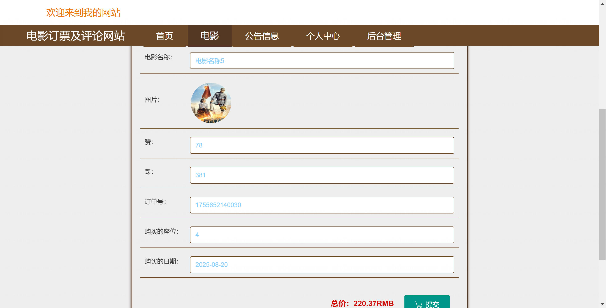

<h1 align="center">基于SpringBoot+Vue的电影订票及评论网站【带论文】</h1>

- <b>完整代码获取地址：从戎源码网 ([https://armycodes.com/](https://armycodes.com/))</b>
- <b>技术探讨、资料分享，请加QQ群：692619798</b>
- <b>作者微信：19941326836  QQ：952045282</b>
- <b>承接计算机毕业设计、Java毕业设计、Python毕业设计、深度学习、机器学习</b>
- <b>选题+开题报告+任务书+程序定制+安装调试+论文+答辩ppt 一条龙服务</b>
- <b>所有选题地址 ([https://github.com/Descartes007/allProject](https://github.com/Descartes007/allProject)) </b>

## 一、项目介绍

基于SpringBoot+Vue的电影订票及评论网站，系统角色为后台管理员（管理端）和普通用户（前端用户），主要功能如下
### 后台管理员：
- 基本操作：登录、修改密码、获取/修改个人信息、登出
- 用户管理：用户分页查询、查看详情、新增、修改、删除、重置密码、获取 session 信息
- 电影管理：电影分页/列表、查看详情、添加、修改、逻辑删除、上下架管理、图片上传、字典字段转换（类型、上下架等）
- 订单管理：订单分页/列表、查看详情、保存、修改、删除订单状态管理（发货、收货、退款）
- 评论管理：影评分页/列表、查看详情、添加/回复、删除
- 收藏管理：电影收藏的增删查（用户收藏/取消/列表）
- 公告/配置管理：公告（news）管理、站点配置/轮播图管理（配置 CRUD、前端展示）
### 普通用户（前端）：
- 基本操作：注册、登录、退出、重置密码、获取/修改个人信息、查看个人中心
- 电影浏览：电影列表、详情、筛选、按类型/关键词排序
- 购票/下单：选座下单、余额支付校验、生成订单、查看订单列表与详情、申请退款、评价订单（生成评论）
- 评论与收藏：对电影发表评论、查看评论、收藏/取消收藏电影、查看个人收藏列表

## 二、项目技术

- 编程语言：Java（后端）
- 项目架构：B/S 架构
- 端技术：Vue 2.x、Vue Router、Element UI、axios、vue-quill-editor（富文本）、

## 三、运行环境

- JDK版本：1.8及以上都可以
- 操作系统：Windows7/10、MacOS
- 开发工具：IDEA、Ecplise、MyEclipse都可以

## 四、数据库配置文件

- npm版本：6.14.13及以上都可以
- Redis版本：3.2.100及以上都可以
- 文件名：application.yml
- 编码类型：utf8

## 论文截图

## 系统截图

